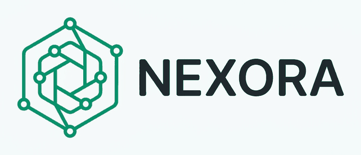

# nexora-iot-ui

[](https://www.npmjs.com/package/nexora-iot-ui)
[](https://bundlephobia.com/package/nexora-iot-ui)
[](LICENSE)

React components for IoT and industrial monitoring UIs — plus an optional data
layer that wires them to a real device over [Portal](https://useportal.co), with
no backend of your own.

```bash
npm install nexora-iot-ui
```

## Quickstart

A dashboard that shows live readings from a device and can command it back:

```tsx
import "nexora-iot-ui/styles.css"
import { PortalDeviceProvider, ConnectedTelemetryCard, ConnectedActuatorButton }
  from "nexora-iot-ui/portal"

export default function App() {
  return (
    <PortalDeviceProvider
      getToken={async () => (await (await fetch("/token")).json()).token}
      defaultChannelId="device:esp32-01"
    >
      <ConnectedTelemetryCard label="Temperature" metric="temperature" unit="°C" precision={1} />
      <ConnectedActuatorButton
        label="Start motor"
        commandType="MOTOR_COMMAND"
        action={{ action: "START_MOTOR" }}
      />
    </PortalDeviceProvider>
  )
}
```

That is the whole client. The board publishes telemetry on its channel, the browser
reads the same channel, and commands travel back the same way — there is no server of
yours in the middle. What the board has to say to make this work is one page:
[`docs/PROTOCOLO.md`](docs/PROTOCOLO.md).

`react` and `react-dom` (v19) are peer dependencies — you already have them.

### Two entry points

Consumers who only want the components never pull in the transport:

| Entry | What you get |
|---|---|
| `nexora-iot-ui` | Nine presentation-only components. No network, no device knowledge |
| `nexora-iot-ui/portal` | Provider, hooks and three connected wrappers |

That split is not decoration. The components take everything through props and report
intent through callbacks; they never decide anything. If Portal stops being the right
transport, the component set survives intact and only the second entry is thrown away.

### Fonts are not bundled

Shipping them inlined added 400 kB of base64 to the stylesheet for something most apps
already solve. The design language expects Inter and JetBrains Mono:

```bash
npm i @fontsource-variable/inter @fontsource-variable/jetbrains-mono
```

Import them yourself, or serve them however you like. Any other pair still works; only
the look changes. The stylesheet itself is 38 kB (7 kB gzipped).

## Components

Presentation-only, controlled, and accessible: keyboard support on interactive rows,
`role="log"` on the console, `aria-busy` on in-flight actions, and `motion-reduce`
guards on every animation.

### `StatusBadge`
Operational state indicator. Presents the state passed in via `status`
(`"live" | "standby" | "alert" | "offline"`) — never infers it. The `live` pulse is
disabled under `prefers-reduced-motion`; state is always conveyed by text as well as
color. `label` overrides the visible text while keeping the accessible name correctly
cased.

### `TelemetryCard`
A single reading with its unit, an optional trend arrow and a `normal | warning |
critical` status. What counts as a warning is the consumer's call, never the card's.

### `GaugeCard`
The same reading as an arc against a range, for values with meaningful bounds.

### `RealtimeChartCard`
Frame for a live series — title, unit, time range and a status pill. Brings no chart
engine: you render the plot as a child, so the card never dictates your dataviz.

### `DeviceTable`
Inventory of IoT devices as a technical table (ID / NAME / STATUS / LAST METRIC /
LAST SEEN, plus an optional per-row ACTIONS column). `onSelect` makes rows focusable
and Enter/Space activable, and action buttons are labelled `"<ACTION>, <Device>"`.
`loading` shows a single loading row; an `emptyLabel` covers the empty state.

### `CommandLog`
Technical event/command console. Pure viewer — entries come in through the `entries`
prop (id, timestamp, message, level, optional source). Auto-scroll only sticks to the
bottom while the user is near the end. Rendered with `role="log"`.

### `ActuatorButton`
One-shot actuator command (START MOTOR, REBOOT NODE, EMERGENCY STOP, …). Represents
*intent* only: the consumer drives `status` (`"idle" | "executing" | "success" |
"error"`) and reacts to `onExecute`. `executing` disables the button; `success`/`error`
stay clickable for retry. `variant="destructive"` for actions like EMERGENCY STOP.

### `RelaySwitch`
Binary hardware control (pump, relay, valve). Strictly controlled: `checked` always
comes from the consumer and every interaction is reported via `onCheckedChange`.
`loading` marks an in-flight command and blocks the switch. Shows an ON/OFF readout.

### `SetpointSlider`
Numeric setpoint editor (motor RPM, temperature limit, PWM, …). Separates *selection*
(slider → `onValueChange`) from *application* (APPLY SETPOINT → `onApply`).
Out-of-range and non-finite values are clamped; a degenerate range (`min === max`, NaN
bounds) disables the slider and blocks application. APPLY is disabled while no change
is pending.

## `nexora-iot-ui/portal` — the optional data layer

| Export | What it does |
|---|---|
| `PortalDeviceProvider` | Owns the channel registry — one socket per `channelId`, shared |
| `useTelemetry` | `{ latest, history, status, stale, deviceId }` from the device's readings |
| `useActuator` | `{ execute, state }` — sends a command, acknowledges the *send* |
| `useDeviceLog` | Connection events shaped for `CommandLog` |
| `useDeviceChannel` | The primitive underneath. Escape hatch for your own vocabulary |
| `ConnectedTelemetryCard` / `ConnectedRealtimeChart` / `ConnectedActuatorButton` | hook + component, no logic of their own |

### Connected, not live

`status` is the state of the *transport*; `stale` is the state of the *device*. They
are separate on purpose. A channel stays happily open after a board dies, and a
dashboard that keeps showing the last number under a "live" badge is worse than one
that is visibly down — nobody looks twice at a frozen number that claims to be fresh.
`useTelemetry` raises `stale` after `staleMs` without a reading (10 s by default).

### The vocabulary

This is the actual asset — the hooks are four hundred lines anyone could rewrite; the
contract is what lets a new board work without touching the frontend. Any device that
speaks it works with these components.

**Full contract, protocol findings and the board-side reference implementation:
[`docs/PROTOCOLO.md`](docs/PROTOCOLO.md).** The short version:

| Concept | Channel | Transport | `type` | `content` |
|---|---|---|---|---|
| Telemetry | `device:{id}` | ephemeral | `"telemetry"` | flat object of readings |
| Command | `device:{id}` | ephemeral | `"{ACTUATOR}_COMMAND"` | `{ action: string }` |
| Event | `device:{id}` | persistent (HTTP) | `"alert"`, `"state_change"` | free |

- **Telemetry is always ephemeral.** One reading every 2 s, persisted, fills the channel
  history with noise and burns quota. Ephemeral frames carry no `seq`, no persistence and
  no history — exactly what a sensor needs.
- **One channel per device.** Two devices on one channel interleave readings.
- `content` is flat and serializable, ≤2 KB (Portal's limit).

### No API key in the bundle

`PortalDeviceProvider` deliberately takes **no** `apiKey`. Portal's WebSocket upgrade
authenticates on the token alone — the `key` query parameter is optional, verified
against the live API — so your secret `sk_` key stays on your server and there is
nothing to hide in the bundle. `getToken` is the only authentication point; point it at
an endpoint of yours that mints the token.

### Why it doesn't use `@portalsdk/react`

The official SDK (`react@0.1.4` / `core@0.1.5`) **discards inbound ephemeral messages** —
the very channel telemetry travels on. From its own compiled source:

> SPEC: incoming ephemeral messages (no seq) are not modeled — the contract does not place
> them in the ordered window or bind them to a channel event, so they are dropped here
> rather than guessed at.

That contradicts its own `useChannel` JSDoc, which promises `onMessage` fires for messages
"persistent or ephemeral". Verified against the live API: the frames reach the browser
intact and `onMessage` never fires; send a *persistent* message on the same channel and it
fires immediately. The outbound direction works fine.

So `src/portal/channel.ts` implements Portal's wire protocol v1 directly. When the SDK
learns to receive ephemerals, that one file is the only thing to replace — the hooks are
the seam.

## Design language

Design tokens ship with the stylesheet; import `nexora-iot-ui/styles.css` and they are
available as Tailwind v4 theme values.

- **Semantic colors** — surfaces, brand, supporting, borders and data-viz chart scales
  exposed as `--color-*`.
- **Brand** — dark green primary (`#006948`) on neutral surfaces.
- **Typography** — Inter Variable (sans) and JetBrains Mono Variable (mono, for data,
  IDs, timestamps and technical labels).
- **Restrained rounding** — `--radius: 0.25rem`.

Full rationale in [`DESIGN.md`](DESIGN.md).

## Contributing

```bash
pnpm install
pnpm dev        # playground on Vite
pnpm build      # library build + type declarations
pnpm lint
```

Releasing:

```bash
npm version patch      # or minor / major — commits and tags
git push --follow-tags
npm publish            # rebuilds via prepublishOnly; asks for your 2FA code
```

A published version can never be replaced — every change needs a new number. While the
package is on `0.x`, note that `^0.1.0` does **not** match `0.2.0`: a minor bump is a
breaking change as far as npm is concerned, and consumers have to opt in.

## Status

The nine components are stable and presentation-only. `nexora-iot-ui/portal` adds the
device layer; `GaugeCard`, `RelaySwitch`, `SetpointSlider` and `DeviceTable` have no
connected wrapper yet — no real use case has asked for one. With `useTelemetry` and
`useActuator` they connect in four lines.

`src/portal/` and `docs/` are written in Spanish, matching the Nexora project this was
extracted from; the component set stays in English.

MIT © Nexora
